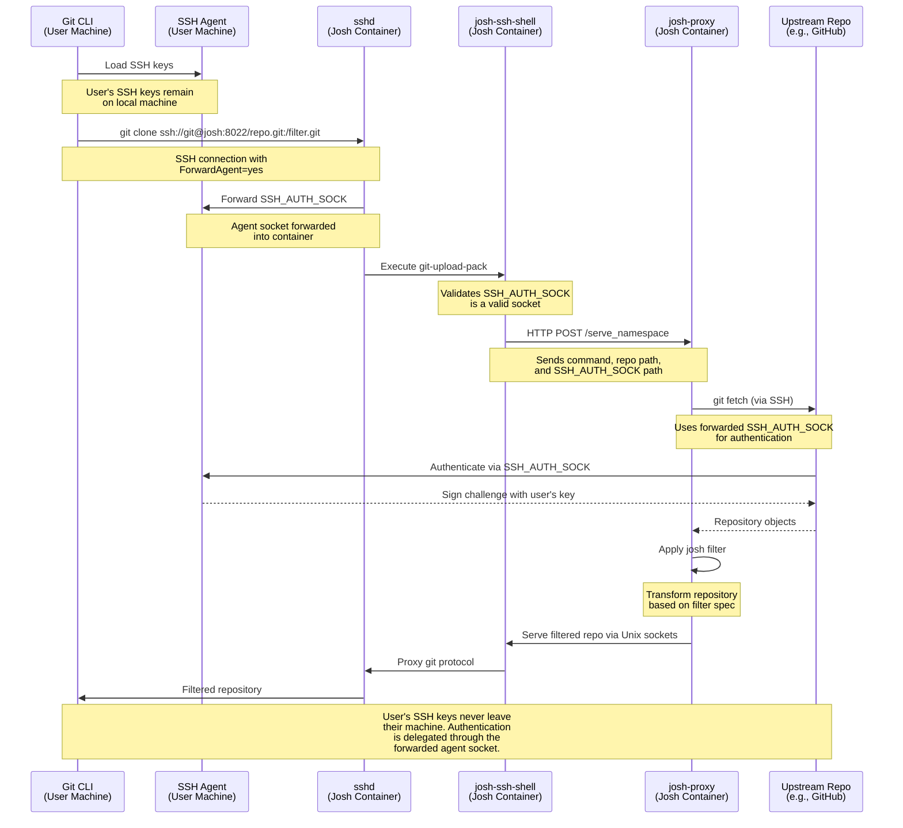

# Container configuration

## Container options

<table>
    <tr>
        <th>
            Variable
        </th>
        <th>
            Meaning
        </th>
    </tr>
    <tr>
        <td>
            <code>JOSH_REMOTE</code>
        </td>
        <td>
            HTTP remote, including protocol.
            Example: <code>https://github.com</code>
        </td>
    </tr>
    <tr>
        <td>
            <code>JOSH_REMOTE_SSH</code>
        </td>
        <td>
            SSH remote, including protocol.
            Example: <code>ssh://git@github.com</code>
        </td>
    </tr>
    <tr>
        <td>
            <code>JOSH_HTTP_PORT</code>
        </td>
        <td>
            HTTP port to listen on.
            Default: 8000
        </td>
    </tr>
    <tr>
        <td>
            <code>JOSH_SSH_PORT</code>
        </td>
        <td>
            SSH port to listen on.
            Default: 8022
        </td>
    </tr>
    <tr>
        <td>
            <code>JOSH_SSH_MAX_STARTUPS</code>
        </td>
        <td>
            Maximum number of concurrent SSH authentication attempts. Default: 16
        </td>
    </tr>
    <tr>
        <td>
            <code>JOSH_SSH_TIMEOUT</code>
        </td>
        <td>
            Timeout, in seconds, for a single request when serving repos over SSH.
            This time should cover fetch from upstream repo, filtering, and serving
            repo to client. Default: 300
        </td>
    </tr>
    <tr>
        <td>
            <code>JOSH_EXTRA_OPTS</code>
        </td>
        <td>
            Extra options passed directly to
            <code>josh-proxy</code> process
        </td>
    </tr>
</table>

## Container volumes

<table>
    <tr>
        <th>
            Volume
        </th>
        <th>
            Purpose
        </th>
    </tr>
    <tr>
        <td>
            <code>/data/git</code>
        </td>
        <td>
            Git cache volume. If this volume is not
            mounted, the cache will be lost every time
            the container is shut down.
        </td>
    </tr>
    <tr>
        <td>
            <code>/data/keys</code>
        </td>
        <td>
            SSH server keys. If this volume is not
            mounted, a new key will be generated on
            each container startup
        </td>
    </tr>
</table>

## Container services

The Josh container uses [s6-overlay](https://github.com/just-containers/s6-overlay) as a process supervisor
to manage multiple services:

### Long-running services

- **josh-proxy** - The main HTTP proxy service that handles git requests, applies filters, and communicates
  with upstream repositories.

- **sshd** - OpenSSH server that provides SSH access to the proxy.

### One-shot initialization services

These services run once during container startup to prepare the environment:

- **josh-generate-keys** - Generates SSH server keys at `/data/keys/.ssh/id_ed25519` if they don't already exist. 
  Therefore, SSH server keys are persisted across container restarts when the volume is mounted.

- **sshd-generate-config** - Generates the sshd configuration file from a template,
  applying configuration environment variables.

## SSH access

Josh supports SSH access.
To use SSH, you need to add the following lines to your `~/.ssh/config`:

```
Host your-josh-instance.com
    ForwardAgent yes
    PreferredAuthentications publickey
```

Alternatively, you can pass those options via `GIT_SSH_COMMAND`:

```
GIT_SSH_COMMAND="ssh -o PreferredAuthentications=publickey -o ForwardAgent=yes" git clone ssh://git@your-josh-instance.internal/...
```

In other words, you need to ensure SSH agent forwarding is enabled.

### How SSH access works



1. **SSH Agent Forwarding**: The user's SSH agent socket is forwarded into the container, allowing josh-proxy to authenticate to upstream repositories without accessing the user's private keys directly.

2. **Two-stage architecture**: `sshd` handles the SSH connection and launches `josh-ssh-shell`, which then communicates with `josh-proxy` via HTTP.

3. **Security**: Private SSH keys never enter the container. All authentication is performed by delegating to the user's local SSH agent through the forwarded socket.
